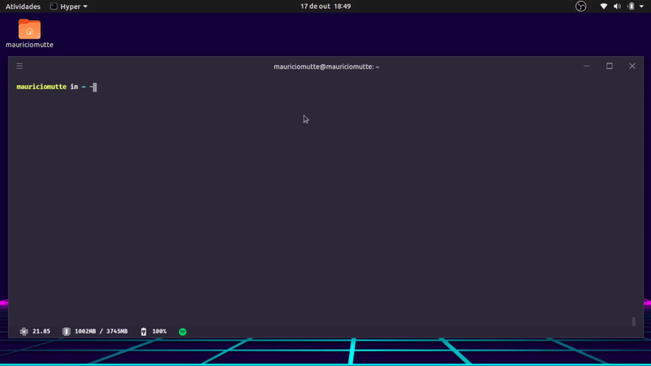

<h1 align="center">Googlezy</h1>
<p align="center">🔎 Google Search on Terminal</p>

<p align="center">
  <a href="https://github.com/mauriciomutte/googlezy/issues">
    
  </a>
  <a href="https://github.com/mauriciomutte/googlezy/blob/master/LICENSE">
    
  </a>
  <a href="https://twitter.com/mauriciomutte/status/1184961537213112320">
    
  </a>
</p>

<p align="center">
  
</p>

## Getting started

```shell
$ npm install -g googlezy
```

## Usage

```shell
$ googlezy "Your search"
```